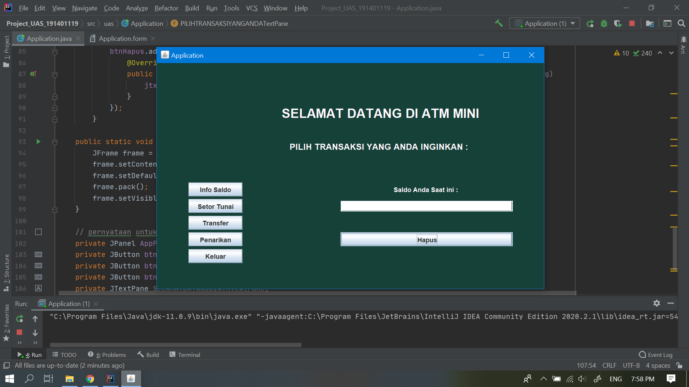
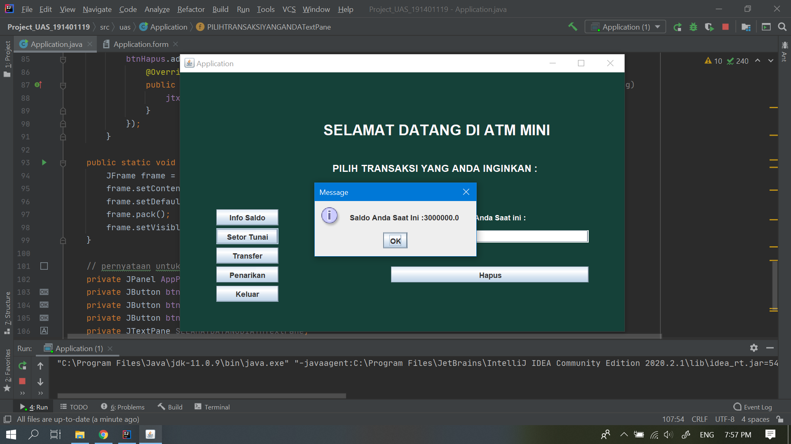
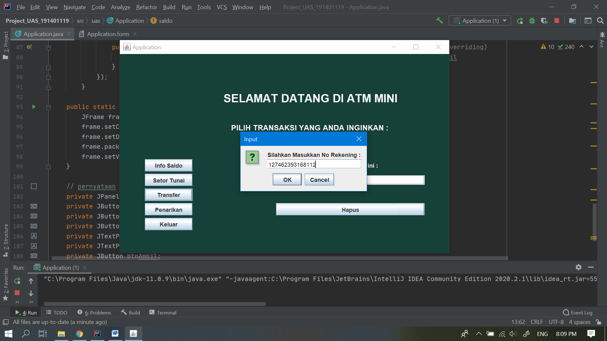
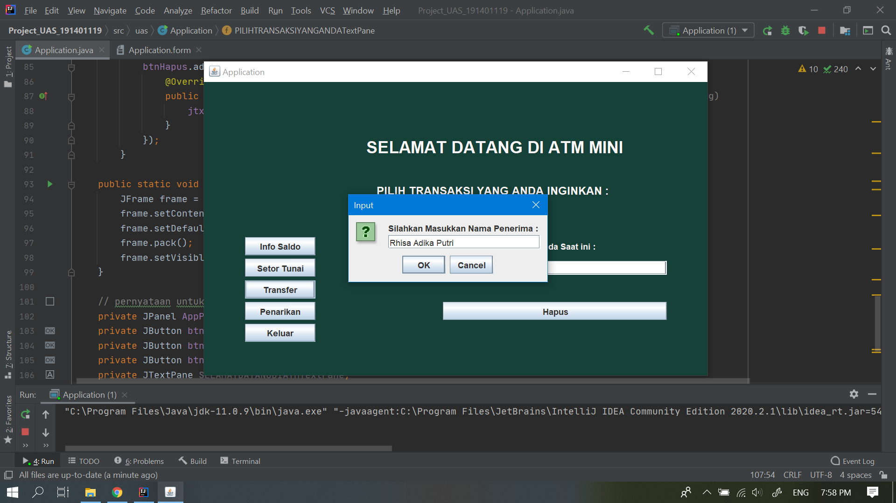
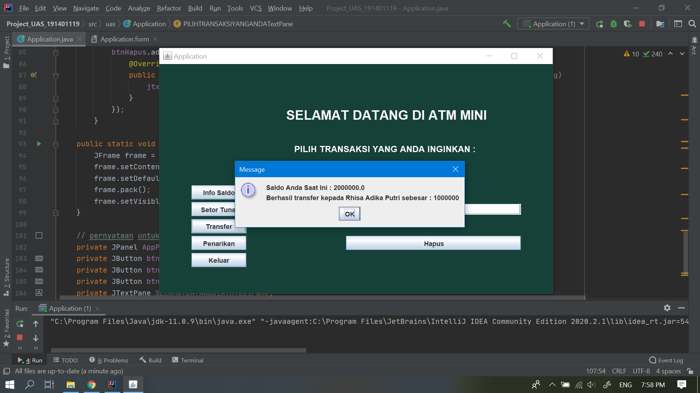
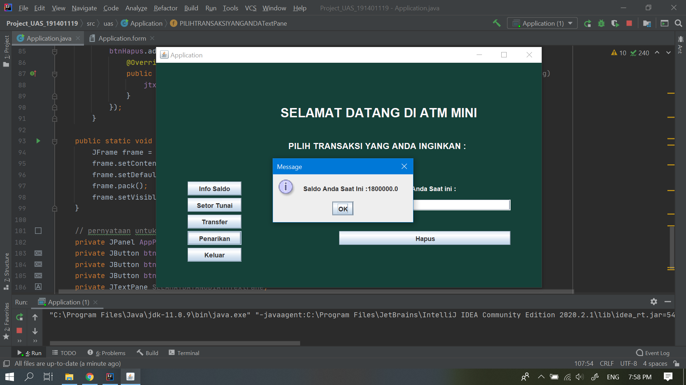

# GUI Simple ATM Application

Create a simple GUI atm application that has conditions, namely:
- Have a theme or scope.
- Have the concept of Inheritance, Encapsulation, Polymorphism.
- Has Inner, Abstract, and Interface classes.
- Has the concept of Exception and Thread.
- Has a label that serves to explain the data.
- Has a TextField that functions to enter data.
- Has a button that functions to display data, delete data, calculate data, and others.

## Some app screenshots

### TampilanAwal

### Proses App 1

### Proses App 2

### Proses App 3

### Proses App 4

### Proses App 5

### Proses App 6

### Proses App 7

### Proses App 8

### Proses App 9

